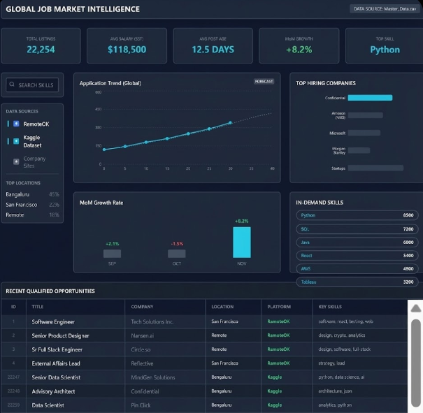

# 🚀 Global Job Market Intelligence & Trend Analyzer

  

## 📖 Project Overview

This project is an end-to-end data analytics pipeline designed to understand the real-time demand for data professionals. It combines live scraping of job boards with historical data to provide a complete picture of hiring velocity, skill trends, and market structure.

---

## 📊 Interactive Dashboard

An advanced Power BI dashboard was designed to visualize key metrics, forecast hiring trends using historical data, and allow for interactive filtering of job opportunities.



### Key Insights Highlights:
* **Hiring Trend Forecast:** Utilizing historical data points to project stable hiring volume over the next 30 days.
* **Skill Ecosystem:** Mapping the co-occurrence of skills (e.g., showing how Python pairs with AWS and Azure) to guide learning paths.
* **Market Fragmentation:** Analysis reveals that the top 10 hiring companies control a small percentage of the market, indicating a wide "long tail" of opportunities in smaller firms.

---

## 🛠️ Technical Process & Structure

The project is organized by technical domain:

```text
COURSE_PROJECT/
├── data/                  # Raw and processed datasets (CSV/Excel)
├── etl_pipeline/          # Python scripts for Scraping, ETL, and Forecasting
├── power_bi/              # Dashboard visualization assets
└── sql_analytics/         # Database schema created and advanced SQL KPIs
